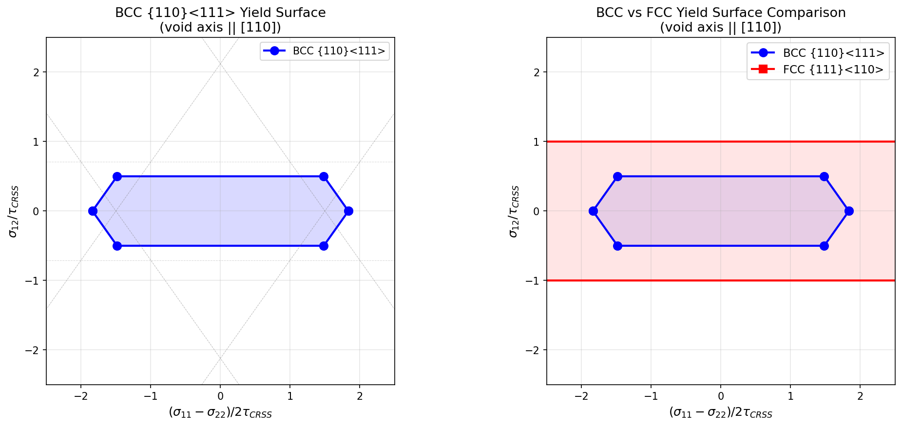
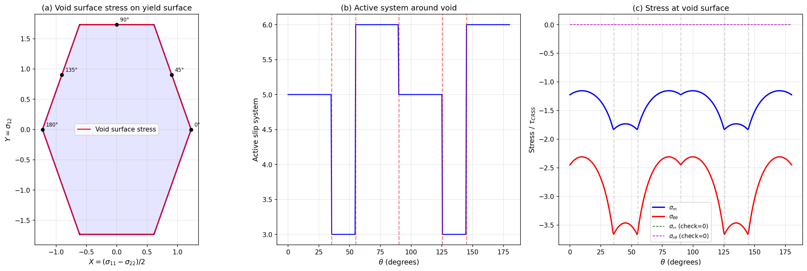

# Analytical Stress Field Around a Cylindrical Void in a BCC Single Crystal

**Anisotropic slip-line theory solution for {110}⟨111⟩ body-centered cubic crystals**

This repository contains the first analytical solution for the stress field around a cylindrical void in a rigid-ideally plastic BCC single crystal, extending the classical work of Kysar et al. (2005, FCC) and Gan & Kysar (2007, HCP) to body-centered cubic crystal structures.

All derivations are verified symbolically using SymPy.

---

## Table of Contents

1. [Motivation](#1-motivation)
2. [Problem Statement](#2-problem-statement)
3. [Crystal Geometry and Slip Systems](#3-crystal-geometry-and-slip-systems)
4. [Coordinate Transformation to the Plane Strain Frame](#4-coordinate-transformation-to-the-plane-strain-frame)
5. [Effective In-Plane Slip Systems](#5-effective-in-plane-slip-systems)
6. [Yield Polygon in the Mohr Stress Plane](#6-yield-polygon-in-the-mohr-stress-plane)
7. [Sector Solution: Rice's Anisotropic Slip-Line Theory](#7-sector-solution-rices-anisotropic-slip-line-theory)
8. [Exact Stress Field at the Void Surface](#8-exact-stress-field-at-the-void-surface)
9. [Activation Pressure for Void Growth](#9-activation-pressure-for-void-growth)
10. [BCC vs FCC Comparison](#10-bcc-vs-fcc-comparison)
11. [Physical Implications](#11-physical-implications)
12. [References](#12-references)

---

## 1. Motivation

Ductile fracture in metals is governed by the nucleation, growth, and coalescence of microscale voids. These voids exist predominantly within single grains of a polycrystalline material, so the anisotropic nature of the surrounding crystal must be accounted for.

Kysar et al. (2005) derived the analytical stress field around a cylindrical void in an FCC single crystal using Rice's (1973) anisotropic slip-line theory. Gan & Kysar (2007) extended this to HCP crystals. However, **no analytical solution exists for BCC crystals** — an 18-year gap in the literature.

BCC metals (iron, tungsten, molybdenum, chromium) are among the most important structural materials. In particular, BCC ferritic/martensitic steels resist radiation-induced void swelling significantly better than FCC austenitic steels. Understanding this difference at the single-crystal level requires analytical solutions for void growth in BCC.

This work fills that gap.

---

## 2. Problem Statement

Consider an infinitely long cylindrical void of radius $a$ embedded in an infinite rigid-ideally plastic BCC single crystal. The void axis is aligned with the $[110]$ crystallographic direction.

**Loading:** Equibiaxial far-field compressive stress $\sigma_{rr} = \sigma_{\theta\theta} = -p$ at $r \to \infty$.

**Boundary conditions:**
- Void surface ($r = a$): traction-free, $\sigma_{rr} = \sigma_{r\theta} = 0$
- Far field ($r \to \infty$): $\sigma_{rr} = \sigma_{\theta\theta} = -p$, $\sigma_{r\theta} = 0$

**Constitutive model:** Rigid-ideally plastic with the Schmid law. Slip occurs on BCC {110}⟨111⟩ systems when the resolved shear stress reaches the critical value $\tau_{\text{CRSS}}$.

**Goal:** Find the complete stress field $\sigma_{ij}(r, \theta)$ and the activation pressure $p^*$ for plastic flow around the void.

---

## 3. Crystal Geometry and Slip Systems

BCC crystals have 12 slip systems in the {110}⟨111⟩ family. Each slip system $\alpha$ is defined by a slip plane normal $\mathbf{n}^\alpha$ and a slip direction $\mathbf{s}^\alpha$:

| System | Slip Plane $(hkl)$ | Slip Direction $[uvw]$ |
|--------|-------------------|----------------------|
| 1 | $(110)$ | $[\bar{1}11]$ |
| 2 | $(110)$ | $[1\bar{1}1]$ |
| 3 | $(1\bar{1}0)$ | $[111]$ |
| 4 | $(1\bar{1}0)$ | $[\bar{1}\bar{1}1]$ |
| 5 | $(101)$ | $[\bar{1}11]$ |
| 6 | $(101)$ | $[11\bar{1}]$ |
| 7 | $(10\bar{1})$ | $[111]$ |
| 8 | $(10\bar{1})$ | $[\bar{1}1\bar{1}]$ |
| 9 | $(011)$ | $[1\bar{1}1]$ |
| 10 | $(011)$ | $[11\bar{1}]$ |
| 11 | $(01\bar{1})$ | $[111]$ |
| 12 | $(01\bar{1})$ | $[1\bar{1}\bar{1}]$ |

The resolved shear stress on system $\alpha$ is:

$$\tau^\alpha = P^\alpha_{ij} \sigma_{ij}, \qquad P^\alpha_{ij} = \frac{1}{2}\left(\hat{s}^\alpha_i \hat{n}^\alpha_j + \hat{s}^\alpha_j \hat{n}^\alpha_i\right)$$

Yield occurs when $|\tau^\alpha| = \tau_{\text{CRSS}}$ on any system.

---

## 4. Coordinate Transformation to the Plane Strain Frame

With the void axis along $[110]$, we define the plane strain coordinate system:

$$\mathbf{e}'_1 = [001], \qquad \mathbf{e}'_2 = \frac{1}{\sqrt{2}}[\bar{1}10], \qquad \mathbf{e}'_3 = \frac{1}{\sqrt{2}}[110]$$

The rotation matrix from crystal to primed coordinates is:

$$\mathbf{R} = \begin{pmatrix} 0 & 0 & 1 \\ -1/\sqrt{2} & 1/\sqrt{2} & 0 \\ 1/\sqrt{2} & 1/\sqrt{2} & 0 \end{pmatrix}$$

Transforming all 12 slip systems to primed coordinates and computing the in-plane Schmid tensor components yields the resolved shear stress for each system in terms of the Mohr plane coordinates $X = (\sigma_{11} - \sigma_{22})/2$ and $Y = \sigma_{12}$:

$$\tau^\alpha = a^\alpha X + b^\alpha Y$$

| System | $a^\alpha$ | $b^\alpha$ | Note |
|--------|-----------|-----------|------|
| 1, 2 | $0$ | $0$ | **Zero in-plane Schmid factor** (anti-plane only) |
| 3, 4 | $0$ | $-\sqrt{3}/3$ | Pure shear constraint |
| 5, 12 | $+\sqrt{6}/3$ | $+\sqrt{3}/6$ | Inclined face (+) |
| 6, 11 | $-\sqrt{6}/3$ | $+\sqrt{3}/6$ | Inclined face (-) |
| 7, 10 | $-\sqrt{6}/3$ | $-\sqrt{3}/6$ | Mirror of 6, 11 |
| 8, 9 | $+\sqrt{6}/3$ | $-\sqrt{3}/6$ | Mirror of 5, 12 |

**Key finding:** Systems 1 and 2 (on the $(110)$ plane, which contains the void axis) produce zero resolved shear stress from any in-plane deviatoric stress. They contribute only anti-plane shear and do not participate in the plane strain yield surface.

---

## 5. Effective In-Plane Slip Systems

For plane strain deformation, 3D slip systems must combine pairwise to eliminate out-of-plane strain components ($d_{33} = d_{13} = d_{23} = 0$). The 10 active systems (excluding 1, 2) produce 7 valid pairwise combinations that reduce to **3 distinct yield constraints**:

| Constraint | Equation | Contributing Systems |
|-----------|----------|---------------------|
| I | $\left\lvert -\frac{\sqrt{3}}{3} Y \right\rvert \leq \tau_{\text{CRSS}}$ | 3, 4 (same-plane pair on $(1\bar{1}0)$) |
| II | $\left\lvert \frac{\sqrt{6}}{3} X + \frac{\sqrt{3}}{6} Y \right\rvert \leq \tau_{\text{CRSS}}$ | 5, 12 (cross-plane pair) |
| III | $\left\lvert -\frac{\sqrt{6}}{3} X + \frac{\sqrt{3}}{6} Y \right\rvert \leq \tau_{\text{CRSS}}$ | 6, 11 (cross-plane pair) |

**Notable:** In FCC, all 3 effective systems come from same-plane pairings. In BCC, only 1 of 3 comes from a same-plane pair (systems 3, 4). The other two involve **cross-plane** pairings — a fundamental structural difference.

---

## 6. Yield Polygon in the Mohr Stress Plane

The intersection of the 3 yield constraints (each giving 2 parallel lines) forms a **hexagonal yield polygon** in the Mohr stress plane $(X, Y)$:

### Vertices (in units of $\tau_{\text{CRSS}}$)

| Vertex | $X$ | $Y$ | Mohr Angle |
|--------|-----|-----|-----------|
| $V_1$ | $-\sqrt{6}/4$ | $-\sqrt{3}$ | $-109.47°$ |
| $V_2$ | $+\sqrt{6}/4$ | $-\sqrt{3}$ | $-70.53°$ |
| $V_3$ | $+\sqrt{6}/2$ | $0$ | $0°$ |
| $V_4$ | $+\sqrt{6}/4$ | $+\sqrt{3}$ | $+70.53°$ |
| $V_5$ | $-\sqrt{6}/4$ | $+\sqrt{3}$ | $+109.47°$ |
| $V_6$ | $-\sqrt{6}/2$ | $0$ | $180°$ |

### Yield Faces

| Face | Equation | Active Systems |
|------|----------|---------------|
| $V_1 \to V_2$ | $Y = -\sqrt{3}$ (horizontal) | 3, 4 |
| $V_2 \to V_3$ | $\frac{\sqrt{6}}{3}X - \frac{\sqrt{3}}{6}Y = 1$ | 8, 9 |
| $V_3 \to V_4$ | $\frac{\sqrt{6}}{3}X + \frac{\sqrt{3}}{6}Y = 1$ | 5, 12 |
| $V_4 \to V_5$ | $Y = +\sqrt{3}$ (horizontal) | 3, 4 |
| $V_5 \to V_6$ | $-\frac{\sqrt{6}}{3}X - \frac{\sqrt{3}}{6}Y = 1$ | 6, 11 |
| $V_6 \to V_1$ | $-\frac{\sqrt{6}}{3}X + \frac{\sqrt{3}}{6}Y = -1$ | 7, 10 |

### Yield Surface Plot



*Left: BCC {110}⟨111⟩ yield surface. Right: BCC (blue) vs FCC {111}⟨110⟩ (red) comparison. The BCC hexagon is rotated by arctan(2√2)/2 ≈ 35.26° relative to FCC but has the same inscribed circle radius.*

---

## 7. Sector Solution: Rice's Anisotropic Slip-Line Theory

### Framework

Following Rice (1973), for a rigid-ideally plastic anisotropic material under plane strain, the equilibrium equations along the two families of characteristic curves (slip lines) take the form:

$$\sigma_m + s = \text{const} \quad \text{along } \alpha\text{-lines}$$
$$\sigma_m - s = \text{const} \quad \text{along } \beta\text{-lines}$$

where $\sigma_m = (\sigma_{11} + \sigma_{22})/2$ is the mean in-plane stress and $s$ is the arc length along the yield contour in the Mohr stress plane.

### Sector Structure

Within each angular sector around the void, one yield face is active. The stress state $(X, Y)$ lies on that face, and $\sigma_m$ varies to satisfy equilibrium. The sector boundaries occur at angles where the stress state passes through a **vertex** of the yield polygon (double-slip state).

The key equilibrium result for $r$-independent stress:

$$\frac{dX}{d\theta} \sin(2\theta) = \frac{dY}{d\theta} \cos(2\theta)$$

$$\frac{d\sigma_m}{d\theta} = \frac{dX}{d\theta} \cos(2\theta) + \frac{dY}{d\theta} \sin(2\theta)$$

Combined with the yield face constraint $aX + bY = \pm 1$, this gives:

$$\tan(2\theta) = -\frac{a}{b}$$

This means the stress can only vary with $\theta$ at **specific angles** determined by the yield face coefficients. At all other angles, the stress is constant (vertex state). The sector solution thus consists of:

1. **Constant stress regions**: stress at a yield polygon vertex (double slip)
2. **Centered fan lines**: stress transitions between adjacent vertices along a yield face, occurring at the specific angle $\theta_{\text{fan}} = \frac{1}{2}\arctan(-a/b)$

### Exact Sector Boundaries

All sector boundaries are determined by the Mohr plane angles of the yield polygon vertices. Using $\theta_{\text{boundary}} = \frac{1}{2} \times (\text{Mohr angle of vertex})$:

| Boundary | Expression | Numerical Value |
|----------|-----------|-----------------|
| $\theta_1$ | $\frac{1}{2}\arctan(2\sqrt{2})$ | $35.264°$ |
| $\theta_2$ | $\frac{1}{2}\left(\pi - \arctan(2\sqrt{2})\right)$ | $54.736°$ |
| $\theta_3$ | $\pi/2$ | $90.000°$ |
| $\theta_4$ | $\pi - \theta_2$ | $125.264°$ |
| $\theta_5$ | $\pi - \theta_1$ | $144.736°$ |

This gives **6 sectors** in $[0°, 180°]$:

| Sector | $\theta$ Range | Active Face | Active Systems |
|--------|---------------|-------------|----------------|
| I | $0 \to \theta_1$ | $V_3 \to V_4$ | 5, 12 |
| II | $\theta_1 \to \theta_2$ | $V_4 \to V_5$ | 3, 4 |
| III | $\theta_2 \to \pi/2$ | $V_5 \to V_6$ | 6, 11 |
| IV | $\pi/2 \to \theta_4$ | Mirror of III | 5, 12 |
| V | $\theta_4 \to \theta_5$ | Mirror of II | 3, 4 |
| VI | $\theta_5 \to \pi$ | Mirror of I | 6, 11 |



*Left: Void surface stress path on the yield polygon. Center: Active slip system vs angle. Right: Stress components at the void surface.*

---

## 8. Exact Stress Field at the Void Surface

At the void surface ($r = a$), the traction-free conditions $\sigma_{rr} = \sigma_{r\theta} = 0$ uniquely determine the stress state. Using the polar-to-Cartesian stress transformation:

$$\sigma_{r\theta} = -X\sin(2\theta) + Y\cos(2\theta) = 0 \implies Y = X\tan(2\theta)$$

$$\sigma_{rr} = \sigma_m + X\cos(2\theta) + Y\sin(2\theta) = 0 \implies \sigma_m = -\frac{X}{\cos(2\theta)}$$

Combined with the active yield face equation $aX + bY = \pm 1$:

$$X(\theta) = \frac{\pm 1}{a + b\tan(2\theta)}$$

### Sector I: $0 < \theta < \theta_1$ (Face $V_3 \to V_4$, systems 5, 12)

Active face: $\frac{\sqrt{6}}{3}X + \frac{\sqrt{3}}{6}Y = 1$

$$X(\theta) = \frac{6}{\sqrt{3}\tan(2\theta) + 2\sqrt{6}\cos(2\theta)/\cos(2\theta)}  = \frac{6}{\sqrt{3}\tan(2\theta) + 2\sqrt{6}}$$

$$Y(\theta) = X(\theta) \cdot \tan(2\theta)$$

$$\sigma_m(\theta) = \frac{-6}{\sqrt{3}\sin(2\theta) + 2\sqrt{6}\cos(2\theta)}$$

$$\sigma_{\theta\theta}(\theta) = \frac{-12}{\sqrt{3}\sin(2\theta) + 2\sqrt{6}\cos(2\theta)}$$

### Sector II: $\theta_1 < \theta < \theta_2$ (Face $V_4 \to V_5$, systems 3, 4)

Active face: $-\frac{\sqrt{3}}{3}Y = -1 \implies Y = \sqrt{3}$ (constant)

$$X(\theta) = \frac{\sqrt{3}}{\tan(2\theta)}$$

$$\sigma_m(\theta) = \frac{-\sqrt{3}}{\sin(2\theta)}$$

$$\sigma_{\theta\theta}(\theta) = \frac{-2\sqrt{3}}{\sin(2\theta)}$$

**Notable:** In this sector, $\sigma_{12} = Y = \sqrt{3}\,\tau_{\text{CRSS}}$ is constant — the shear stress is uniform.

### Sector III: $\theta_2 < \theta < \pi/2$ (Face $V_5 \to V_6$, systems 6, 11)

Active face: $-\frac{\sqrt{6}}{3}X + \frac{\sqrt{3}}{6}Y = -1$

$$\sigma_m(\theta) = \frac{6}{\sqrt{3}\sin(2\theta) - 2\sqrt{6}\cos(2\theta)}$$

$$\sigma_{\theta\theta}(\theta) = \frac{12}{\sqrt{3}\sin(2\theta) - 2\sqrt{6}\cos(2\theta)}$$

### Sectors IV–VI

Follow by mirror symmetry about $\theta = \pi/2$:

$$\sigma_{ij}(\pi - \theta) = \sigma_{ij}(\theta) \quad \text{(with appropriate sign changes on shear components)}$$

---

## 9. Activation Pressure for Void Growth

The activation pressure is the far-field equibiaxial stress required to maintain full plastic flow around the void. It equals the maximum $|\sigma_m|$ at the void surface:

$$\sigma_m(\theta = 0) = -\frac{\sqrt{6}}{2}\,\tau_{\text{CRSS}}$$

$$\sigma_m(\theta = \theta_1) = -\frac{3\sqrt{6}}{4}\,\tau_{\text{CRSS}}$$

The maximum occurs at the sector boundaries $\theta_1$ and $\theta_2$:

$$\boxed{p^* = \frac{3\sqrt{6}}{4}\,\tau_{\text{CRSS}} \approx 1.837\,\tau_{\text{CRSS}}}$$

For comparison:

| Material | Activation Pressure $p^*/\tau$ |
|----------|-------------------------------|
| Isotropic (Tresca) | $1.000$ |
| Isotropic (von Mises) | $2/\sqrt{3} \approx 1.155$ |
| FCC (Kysar 2005) | $\sqrt{6}/2 \approx 1.225$ |
| **BCC (this work)** | $3\sqrt{6}/4 \approx 1.837$ |

**The BCC activation pressure is 50% higher than FCC.** This provides a quantitative single-crystal-level explanation for why BCC metals resist void growth more effectively than FCC metals.

---

## 10. BCC vs FCC Comparison

### Yield Polygon Geometry

Both BCC and FCC yield polygons are hexagons, but with important differences:

| Property | FCC {111}⟨110⟩ | BCC {110}⟨111⟩ |
|----------|----------------|----------------|
| Number of effective in-plane systems | 3 | 3 (from 5 effective pairs) |
| Yield polygon shape | Regular hexagon | Elongated hexagon |
| Max $\|X\|$ (half-width) | $\sqrt{6}/2 \approx 1.225$ | $\sqrt{6}/2 \approx 1.225$ |
| Max $\|Y\|$ (half-height) | $1.0$ | $\sqrt{3} \approx 1.732$ |
| Aspect ratio (height/width) | $\sqrt{2/3} \approx 0.816$ | $\sqrt{8/3} \approx 1.633$ |
| Rotation (Mohr plane) | $0°$ | $\arctan(2\sqrt{2})/2 \approx 35.26°$ |

### Sector Structure

| Property | FCC | BCC |
|----------|-----|-----|
| Number of sectors in $[0°, 180°]$ | 6 | 6 |
| Sector boundary angles | $0°, 27.4°, 62.6°, 90°, 117.4°, 152.6°$ | $0°, 35.3°, 54.7°, 90°, 125.3°, 144.7°$ |
| Key angle | $\arctan(\sqrt{2}) \approx 54.74°$ | $\arctan(2\sqrt{2}) \approx 70.53°$ |

### Physical Differences

1. **Activation pressure**: BCC requires **50% more stress** to activate plastic flow around the void than FCC ($1.837$ vs $1.225$ $\tau_{\text{CRSS}}$). This is a direct consequence of the elongated BCC yield polygon.

2. **Slip system activation pattern**: Different systems activate at different angular positions, leading to different plastic strain distributions around the void.

3. **Anti-plane shear**: BCC has 2 systems (1, 2) with zero in-plane Schmid factor that only contribute anti-plane shear — no equivalent exists in FCC.

---

## 11. Physical Implications

### Radiation Void Swelling Resistance

BCC ferritic/martensitic steels resist radiation-induced void swelling significantly better than FCC austenitic steels. Our analytical solution provides a mechanistic explanation at the single-crystal level:

- **Higher activation pressure** ($p^*/\tau_{\text{CRSS}} = 1.837$ for BCC vs $1.225$ for FCC) means BCC crystals require 50% more stress to initiate plastic flow around a void
- The **elongated yield polygon** makes the BCC crystal "harder" to deform around voids under hydrostatic stress
- Under non-equibiaxial loading (radiation-induced stresses are generally triaxial but not equibiaxial), the **rotated hexagon** will produce different void shape evolution

### Implications for Ductile Fracture Models

- Crystal plasticity damage models (Keralavarma & Benzerga, Mbiakop et al.) should incorporate the BCC-specific sector structure
- The analytical void growth rate under equibiaxial loading can now be computed for BCC
- Different sector boundaries mean different **lattice rotation patterns** around voids

### Additive Manufacturing

- AM metals contain gas porosity at the grain scale
- Defect tolerance of AM BCC metals (e.g., tool steels) depends on void-crystal orientation interactions
- This analytical solution provides benchmarks for CPFEM qualification

---

## 12. References

1. Rice, J.R. (1973). "Plane strain slip line theory for anisotropic rigid/plastic materials." *J. Mech. Phys. Solids* 21, 63–74.

2. Rice, J.R. (1987). "Tensile crack tip fields in elastic-ideally plastic crystals." *Mech. Mater.* 6, 317–335.

3. Kysar, J.W., Gan, Y.X., Mendez-Arzuza, G. (2005). "Cylindrical void in a rigid-ideally plastic single crystal. Part I: Anisotropic slip line theory solution for face-centered cubic crystals." *Int. J. Plast.* 21, 1481–1520.

4. Gan, Y.X., Kysar, J.W., Morse, T.L. (2006). "Cylindrical void in a rigid-ideally plastic single crystal II: Experiments and simulations." *Int. J. Plast.* 22, 39–72.

5. Gan, Y.X., Kysar, J.W. (2007). "Cylindrical void in a rigid-ideally plastic single crystal III: Hexagonal close-packed crystal." *Int. J. Plast.* 23, 592–619.

6. Drugan, W.J. (2001). "Asymptotic solutions for tensile crack tip fields without kink-type shear bands in elastic-ideally plastic single crystals." *J. Mech. Phys. Solids* 49, 2155–2176.

7. Hartley, C.S., Kysar, J.W. (2020). "Plane strain deformation by slip in FCC crystals." *Int. J. Plast.* 130, 102671.

8. Niordson, C.F., Kysar, J.W. (2014). "Computational strain gradient crystal plasticity." *J. Mech. Phys. Solids* 62, 31–47.

9. Keralavarma, S.M., Benzerga, A.A. (2010). "A constitutive model for plastically anisotropic solids with non-spherical voids." *J. Mech. Phys. Solids* 58, 874–901.

10. Mbiakop, A., Constantinescu, A., Danas, K. (2015). "An analytical model for porous single crystals with ellipsoidal voids." *J. Mech. Phys. Solids* 84, 436–467.

11. Paux, J., Brenner, R., Kondo, D. (2018). "Plastic yield criterion and hardening of porous single crystals." *Int. J. Solids Struct.* 132–133, 100–119.

12. Khavasad, P.H., Keralavarma, S.M. (2023). "Size-dependent yield criterion for single crystals containing spherical voids." *Int. J. Solids Struct.* 283, 112478.

---

## Repository Structure

```
bcc-void-analytical/
├── README.md                       # This file (detailed derivation)
├── src/
│   ├── derive_bcc_slip_systems.py  # Step 1–2: Slip systems, effective pairs, yield polygon
│   ├── sector_solution.py          # Step 3: Numerical sector structure verification
│   └── exact_stress_field.py       # Step 4: Exact SymPy stress field expressions
├── figures/
│   ├── bcc_vs_fcc_yield_surface.png
│   └── sector_structure.png
└── requirements.txt
```

## Running the Code

```bash
pip install -r requirements.txt

# Step 1: Derive effective slip systems and yield polygon
python src/derive_bcc_slip_systems.py

# Step 2: Compute sector structure (numerical verification)
python src/sector_solution.py

# Step 3: Exact symbolic stress field
python src/exact_stress_field.py
```

## License

MIT

## Citation

If you use this work, please cite:

```bibtex
@misc{bcc_void_analytical_2026,
  title={Analytical Stress Field Around a Cylindrical Void in a BCC Single Crystal},
  author={Sun, WaiChing},
  year={2026},
  url={https://github.com/stvsun/bcc-void-analytical}
}
```
